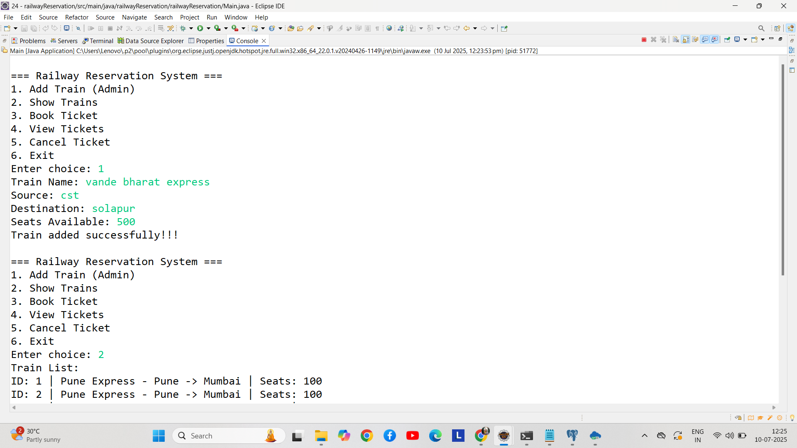

# RailwayReservation
### A console application developed in Java that models a railway reservation system. Users have the ability to register, log in, search for trains, book tickets, cancel bookings, and check their booking history. The project utilizes Core Java, JDBC, PostgreSQL, and Maven.
---
##  🚀 Features
- 👤 User Registration & Login System.
- 🚄 Search Available Trains – by source, destination, date.
- 🎟️ Book Tickets.
- ❌ Cancel Reservations.
- 👁️ View Booking History
- 📊 Reports Generation – Booking Summary, Revenue, Route-wise Traffic

  ---
 ## 🛠️ Technologies Used
- 🔷 Core Java – Handles business logic like booking, cancellation, and user management using OOP.
- 🔗 JDBC – Connects Java code to the PostgreSQL database for data operations.
- 🛢️ PostgreSQL – Stores all system data: users, trains, bookings, and cancellations.
- 📁 Maven – Manages project dependencies and automates builds.
- 🎴 Eclipse IDE – Used for coding, testing, and debugging the application.
 ---
 ##  🧩 Dependencies
 ```xml
 <dependency>
      <groupId>junit</groupId>
      <artifactId>junit</artifactId>
      <version>3.8.1</version>
      <scope>test</scope>
    </dependency>
```

---
## 📦 Prerequisites
- Java JDK

- Apache Maven

- PostgreSQL

- Eclipse IDE /
- --
##  📄Database Tables
```sql
 CREATE TABLE train (
    train_id SERIAL PRIMARY KEY,
    name VARCHAR(100) NOT NULL,
    train_source VARCHAR(100) NOT NULL,
    train_destination VARCHAR(100) NOT NULL,
    seat_available INT NOT NULL
);


 CREATE TABLE ticket_booked (
    ticket_id SERIAL PRIMARY KEY,
    passenger_name VARCHAR(100) NOT NULL,
    train_id INT NOT NULL REFERENCES train(train_id) ON DELETE CASCADE,
    seats_booked INT NOT NULL
);
```
---

## 🖼️ Output(Screenshot)


## 📞 Contact Details
- Name:Bhumi Yuvraj Raut
- Email:bhumiraut5555@gamil.com
- GitHub:BhumiRaut


 


